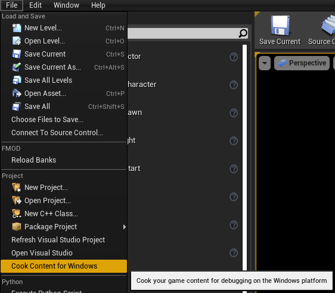
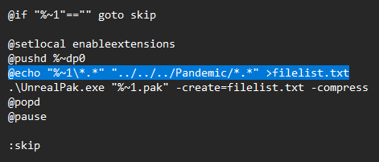

# Creating Mod Packages (.Pak Files)

:::info
This section covers creating packages recognized by Unreal Engine (.pak files), this allows to patch the game files, replacing or adding new content to the game.
:::

### Prerequisites

* **[Unreal Engine 4.27](https://www.unrealengine.com/en-US/download)**
* **[UnrealPak.zip](assets/UnrealPak.zip)** custom batch file and UnrealPak for creating packages.

### Cooking Mod Content in the Unreal Editor

In the editor, navigate to `File > Cook Content for Windows`.

This should start the cooking process, you can ignore any warnings. **Cooking content for the first time can take a while.**

1. Once the cooking process finishes successfully, navigate to your Project directory in Windows Explorer.
2. From there, navigate to `Saved > WindowsNoEditor > Pandemic`
3. You should see a folder named `Content` and potentially another called `Plugins`. These folders contain all of our cooked content.

### Creating a Mod Folder

1. Now, choose a working directory for your mod. In this example, we’ll use `SCP5K_Modding`.
2. Create a new folder here with a specific naming convention. For instance: `pakchunk99-Mods_YourModName_P`

:::info
* **The pakchunk99 naming helps ensure that any possible game content is overwritten.** A higher number indicates higher load priority, so it will overwrite other content.
* **The _P portion is used to 'patch' the files, which helps prevent unnecessary crashes.** The rest of the name is optional, but it's helpful for organization.
:::
 
3. Next, go back to your project’s cooked `Content` folder and copy both the `Content and Plugins` folders. Depending on the content you’ve modified, you might only have one of these folders.
4. Paste the copied folder(s) over to your mod folder. **Do not copy any other folders.**

:::danger
If creating content inside a Plugins folder, it is required to create an additional folder called **AffrayCore** first and placing the plugin folder inside of it. 

For example: `pakchunk99-Mods_YourModName_P\Plugins\AffrayCore\FPSController\Content\Weapons\MK18`
::: 

### Creating Packages from Cooked Content

1. To create packages from your cooked content, we’ll first need to modify the provided batch file.  **Open the .bat file** in a text editor and changed the following line:
   

`@echo "%~1\*.*" "../../../Pandemic/*.*" >filelist.txt`

2. Then, go back to your working directory and simply drag & drop the folder onto the `.bat` file.
3. This will package the content and create a `.pak` file, for an example, `pakchunk99-Mods_YourModName_P.pak`

### Testing Your Packaged Mod

If everything went as expected, you should now have a fully packaged mod ready for use in-game.

To install the mod package, we have to find the game's Paks directory.

1. Navigate to your SCP:5K installation folder.
2. Locate the game packages `(.pak)` in: `5K\WindowsNoEditor\Pandemic\Content\Paks`
3. Copy & paste your modded package file into the Paks directory alongside the other `.pak` files.

**Your modded content should now be available in-game!**

